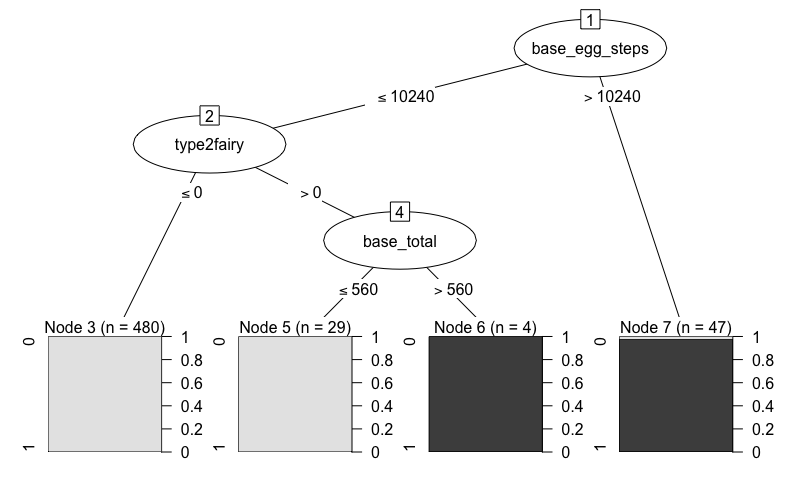

```{r setup, include=FALSE}
knitr::opts_chunk$set(echo = TRUE)
```

### 1. Project Description
In this project, we will be using three Machine Learning methods to predict if the pokemon is legenary or not, using features such as attack, defense abilities, or speed, experience growth profile..etc. The dataset contains 801 observations, 40 features, 1 outcome variables (`is_legendary`). Before training the data with Machine Learning, we also imputed missing data with random forest, and use lasso regression to perform variable selections.

### 2. Load data and library
```{r load, message=FALSE, warning=FALSE}
tdata = read.csv("pokemon.csv", header = T, na.strings = c(" ",''))
library(tidyverse, quietly = T)
library(glmnet, quietly = T)
library(missForest, quietly = T)
library(e1071, quietly = T) 
library(C50, quietly = T)
library(caret, quietly = T)
library(knitr, quietly = T)
library(class, quietly = T)
set.seed(100)
str(tdata)
# remove text formating features: abilities, classfication, japanese_name, name
tdata$capture_rate = as.numeric(tdata$capture_rate)
sdata = tdata %>% select(-c(abilities, classfication, japanese_name, name, pokedex_number)) 
```


### 3. Missing data imputation with Random Forest
In this step, we used random forest to perform missing data imputation. First, we filtered out complete cases in the dataset (N = 339), and generated 10% missingness to perform two types of imputation: (1) set trees to 100, (2) set trees to 200. After, we compared the NRMSE (normalized mean squared error) and PFS (proportion of falsely classified) for both two models, and we found that both models showed similar error. Therefore, we decide to set trees to 200 and perform random forest imputation for the whole data (N = 801).   
1. NRMSE (normalized mean squared error): represent error derived from imputing continuous values.     
2. PFC (proportion of falsely classified):  represent error derived from imputing categorical values.     
```{r impute, warning=FALSE, message=FALSE}
# step 1. use complete cases then generate 10% missing values
x.complete = na.omit(sdata[,-37])
x.mis = prodNA(x.complete, noNA = 0.1)

# step 2-1. impute missing values, ntree = 100
x.imp = missForest(x.mis) # default ntree = 100

# step 2-2: impute missing values, ntree = 200
x.imp2 = missForest(x.mis, ntree = 200) 

# step 3: check imputation error
x.imp$OOBerror  
x.imp2$OOBerror  

# step 4: comparing actual data accuracy
x.err = mixError(x.imp$ximp, x.mis, x.complete)
x.err2 = mixError(x.imp2$ximp, x.mis, x.complete)

err = data.frame(model = c("ntree=100", "ntree=200"), NRMSE = c(x.err[1], x.err2[1]), 
                 PFC = c(x.err[2], x.err2[2]))


# step 5: start imputate all the data using the above `missForest` setting
model.imp = missForest(sdata[,-37], ntree = 200)

# step 6: check imputation error
# NRMSE: 0.0000754659, PFC: 0.0563549161
err_model = data.frame(model = "ntree=200", 
                       NRMSE = format(as.numeric(model.imp$OOBerror[1]), digits = 4), 
                       PFC = format(as.numeric(model.imp$OOBerror[2]), digits = 4))

# step 7: extract imputed data
new.x = model.imp$ximp

```

#### Results after random forest imputation:
(1). NRMSE and PFC for random forest imputation: complete cases with 10% missingness   
```{r}
kable(err)
```


(2). NRMSE and PFC for random forest imputation: whole data
```{r}
kable(err_model)
```


### 4. Convert imputed data to design matrix
In the imputed data, we can see that there are two features that are categories (`type 1`, `type 2`), we used `model,matrix()` to convert imputed data to design matrix
```{r dummy}
# 2. convert to dummy variables
dummy.x = model.matrix( ~ ., model.frame( is_legendary~ ., data = new.x, na.action=na.pass))
dummy.x = dummy.x[,-1] # remove intercept
# colnames(dummy.x)
# dummy.x includes is_legendary (in the first column)
```

### 5. Variable Selection: Lasso Regression
We have total 40 features, after removing features that are in text format (`abilities`, `classfication`, `japanese_name`, `name`), we reached to 37 variables. By fitting lasso regression, we can do variable selections by removing the variables that show coefficient = 0.
```{r lasso}
lasso = cv.glmnet(x = dummy.x[,-1], y = dummy.x[,"is_legendary"], type.measure = 'mse', nfolds = 5, alpha = 1)
coef = coef(lasso, s = 'lambda.min',exact=TRUE)
idx = which(coef!=0)
variables = row.names(coef)[idx]
```

#### These are the varaibles selected after lasso regression:
```{r}
print(variables[-1])
```


### 6. Data Visualization
Now let's take a look at the distribution of `is_legendary` in some of the selected variables. We can see differences in the distribution of `is_legendary` in some of the features.
```{r graph, out.width=c('50%', '50%')}
# subset variable selected from lasso
dummy.fit.x = as.data.frame(dummy.x[, c("is_legendary",variables[-1])])
# create new data
new.data = as.data.frame(dummy.fit.x)
# colnames(new.data) = c(variables[-1], "is_legendary")

# plot some barplot
ggplot(new.data, aes(x = as.factor(is_legendary), y= base_egg_steps, group = as.factor(is_legendary), fill = as.factor(is_legendary))) +
  labs(fill = "is legendary") + 
  scale_y_continuous("Base egg steps") +
  scale_x_discrete("Is legendary") + 
  geom_boxplot()

ggplot(new.data, aes(x = as.factor(is_legendary), y= sp_defense, group = as.factor(is_legendary), fill = as.factor(is_legendary))) +
  labs(fill = "is legendary") + 
  scale_y_continuous("sp defense") +
  scale_x_discrete("Is legendary") + 
  geom_boxplot()

ggplot(new.data, aes(x = as.factor(is_legendary), y= sp_attack, group = as.factor(is_legendary), fill = as.factor(is_legendary))) +
  labs(fill = "is legendary") + 
  scale_y_continuous("sp attack") +
  scale_x_discrete("Is legendary") + 
  geom_boxplot()

ggplot(new.data, aes(x = as.factor(is_legendary), y= speed, group = as.factor(is_legendary), fill = as.factor(is_legendary))) +
  labs(fill = "is legendary") + 
  scale_y_continuous("Speed") +
  scale_x_discrete("Is legendary") + 
  geom_boxplot()
```

### 7. Split train and test data
We split the training and testing set by 7:3 ratio.
```{r}
train_ind = sample(seq_len(nrow(new.data)), size = as.integer(dim(new.data)[1]*0.7))

train = new.data[train_ind,] # N = 560
test = new.data[-train_ind,] # N = 241

```


### 8. Model training with SVM, Decision tree and KNN

Now, the data are good to go for training, we trained the model using SVM with linear kernal, decision tree with 10 trials and KNN (the model will select the best k with the highest accuracy). 
```{r}
# =========================
#   SVM linear kernal
# =========================
svm = svm(formula = as.factor(is_legendary) ~ ., 
                 data = train, 
                 type = 'C-classification', 
                 kernel = 'linear') 

# predict test result
svm.pred = predict(svm, 
                   newdata = as.data.frame(test) %>% dplyr::select(-c(is_legendary))) 

# confusion matrix
cm.svm = confusionMatrix(svm.pred, as.factor(test[, "is_legendary"]), positive = "1")
accuracy.svm = round(as.numeric(cm.svm$overall[1])*100, digits = 2)
kappa.svm = round(as.numeric(cm.svm$overall[2]), digits = 2)
print(cm.svm)

# =============================
# Decision tree with 10 trials
# =============================
ds.tree = C5.0(as.data.frame(train) %>% dplyr::select(-c(is_legendary)), 
               as.factor(train[, "is_legendary"]), 
               trials = 10)

# predict test result
ds.tree.pred = predict(ds.tree, 
                   newdata = as.data.frame(test) %>% dplyr::select(-c(is_legendary))) 

# confusion matrix
cm.ds.tree = confusionMatrix(ds.tree.pred, as.factor(test[, "is_legendary"]), positive = "1")
accuracy.ds.tree = round(as.numeric(cm.ds.tree$overall[1])*100, digits = 2)
kappa.ds.tree = round(as.numeric(cm.ds.tree$overall[2]), digits = 2)

print(cm.ds.tree)

# ===========================
# KNN 
# ===========================

# scale data with z-score standardization
train.scale = scale(train[, -1])
train.scale = as.data.frame(cbind(train.scale, train[,"is_legendary"]))
colnames(train.scale)[length(colnames(train.scale))] = "is_legendary"
test.scale = scale(test[, -1])
test.scale = as.data.frame(cbind(test.scale, test[,"is_legendary"]))
colnames(test.scale)[length(colnames(test.scale))] = "is_legendary"

# train with knn
ctrl = trainControl(method="repeatedcv",repeats = 3) 
knn = train(as.factor(is_legendary) ~ ., data = train.scale, method = "knn", trControl = ctrl, preProcess = c("center","scale"), tuneLength = 20)

# plot accuracy vs neighbors
# best is k = 5
plot(knn)

# predict test result
knn.pred = predict(knn, 
                   newdata = as.data.frame(test) %>% dplyr::select(-c(is_legendary))) 

# confusion matrix
cm.knn = confusionMatrix(knn.pred, as.factor(test[, "is_legendary"]) , positive = "1")
accuracy.knn = round(as.numeric(cm.knn$overall[1])*100, digits = 2)
kappa.knn = round(as.numeric(cm.knn$overall[2]), digits = 2)

print(cm.knn)


# save model
saveRDS(svm, "svm.rds")
saveRDS(ds.tree, "ds.tree.rds")
saveRDS(knn, "knn.rds")
```


### 9. Compare Accuracy and Kappa Statistics:
```{r}
result = data.frame(Statistics = c("Accuracy", "Kappa"), 
                    SVM = c(accuracy.svm, kappa.svm),
                    Decision_tree = c(accuracy.ds.tree, kappa.ds.tree),
                    KNN = c(accuracy.knn, kappa.knn))
kable(result)
```


This is the graphic results for decision tree:  



### 10. Majority voting
At last, lets look at the combine predictions of the three models using a simple majority voting scheme. We defined the majority voting as any two of the model showed same predicted results.

```{r}
pred_majority = as.factor(ifelse(svm.pred == 1 & ds.tree.pred == 1,1,
                                 ifelse(svm.pred == 1 & knn.pred == 1,1,
                                        ifelse(knn.pred == 1 & ds.tree.pred == 1,1,0))))
cm.voting = confusionMatrix(pred_majority, as.factor(test[, "is_legendary"]), positive = "1")
accuracy.voting = round(as.numeric(cm.voting$overall[1])*100, digits = 2)
kappa.voting = round(as.numeric(cm.voting$overall[2]), digits = 2)
print(accuracy.voting)
print(kappa.voting)
```

By looking at the confusion matrix, accuracy after majority voting shows `r accuracy.voting`%, and kappa statistics shows `r kappa.voting`%.

### 11.Conclusion  

In Conclusion, SVM and decision tree has the best predicted results. Looking at the decision tree plot, `base egg steps`, `base total`, `type 2 indicator of fairy` are the parameters that made up the decision model, therefore, these are the parameters that will decide whether the pokemon is legendary or not in the decision tree model. Overall, SMV and decision tree showed good results, since the kappa statistics are > 0.9, and that these two models can be recommended to the manufacturers for generating a new type of legendary pokemon. 


